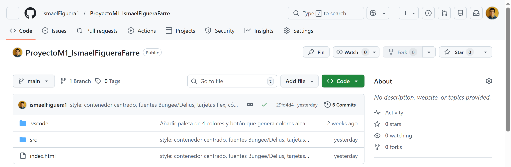
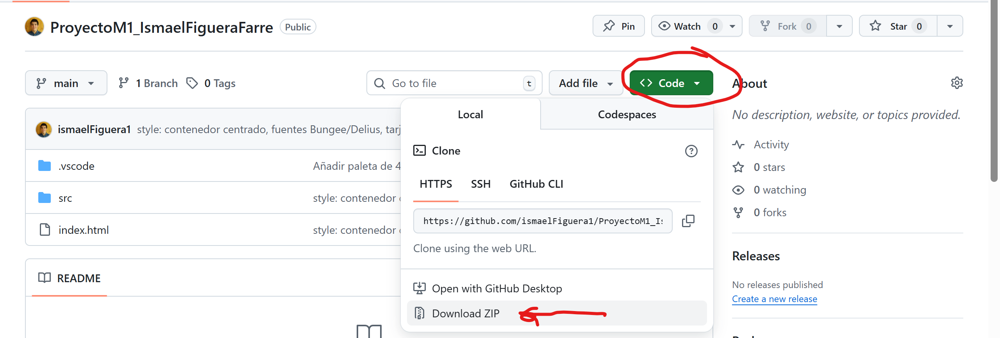
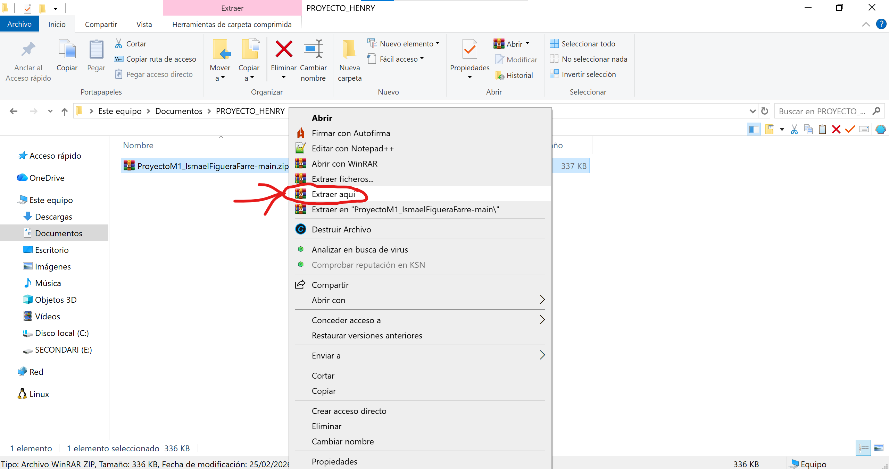
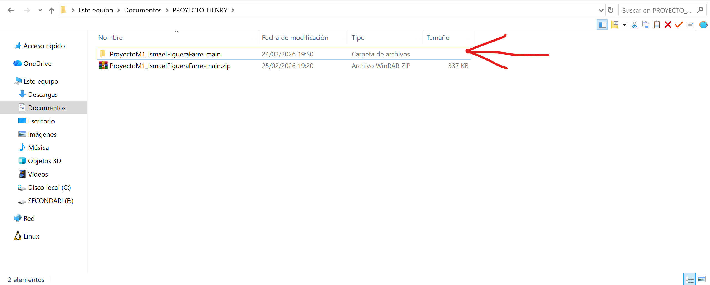
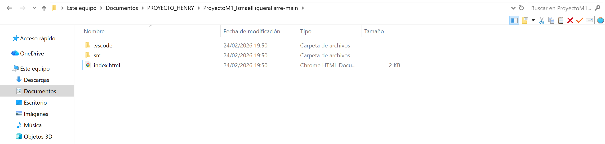
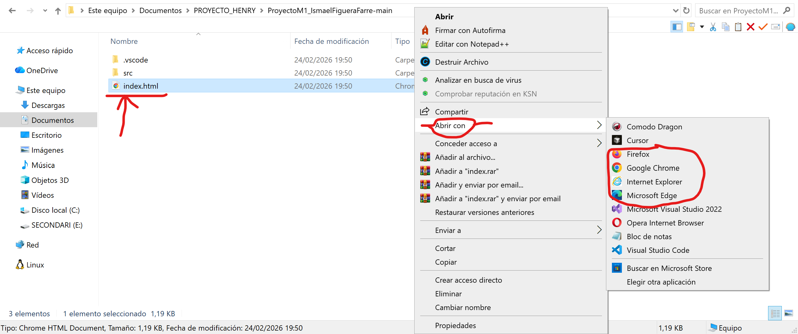
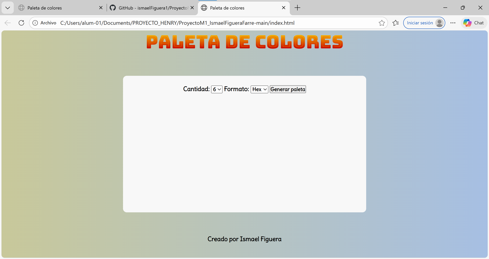

# Paleta de colores

Generador de paletas de colores aleatorias en formato Hex o HSL.

**Demo en vivo:** [Paleta de colores](https://ismaelfiguera1.github.io/ProyectoM1_IsmaelFigueraFarre/)

---

## Cómo usar la aplicación

### Paso 1 — Acceder al repositorio

Entra en el repositorio del proyecto en GitHub para clonarlo, ver el código o abrir la demo desde la descripción:

**🔗 [github.com/ismaelFiguera1/ProyectoM1_IsmaelFigueraFarre](https://github.com/ismaelFiguera1/ProyectoM1_IsmaelFigueraFarre)**

---

### Paso 2 — Descargar el .zip de la aplicación

En la página del repositorio, haz clic en el botón verde **"Code"** y elige **"Download ZIP"**. Se descargará un archivo con todo el proyecto.

---

### Paso 3 — Extraer la carpeta del .zip

Haz **clic derecho** sobre el archivo .zip descargado y elige **"Extraer aquí"** (o "Extract here"). Se creará una carpeta con todo el proyecto en el mismo sitio donde está el .zip.

El resultado debe ser una carpeta con los archivos del proyecto dentro. Así debe verse:

---

### Paso 4 — Abrir la aplicación en el navegador

Abre la carpeta del proyecto que extraíste. Debes ver los archivos y carpetas del proyecto (`index.html` y la carpeta `src` ...):

Haz **clic derecho** sobre el archivo **index.html**, elige **"Abrir con"** y selecciona un **navegador web** (Chrome, Edge, Firefox, etc.). La aplicación se abrirá en el navegador.

---

### Paso 5 — La aplicación en el navegador

La aplicación se abre en el navegador. Debes ver la pantalla de "Paleta de colores" con los controles para elegir cantidad, formato y el botón "Generar paleta". Así debe verse:

---

Si no quieres descargar el proyecto, puedes ver la aplicación desplegada en: **[Paleta de colores](https://ismaelfiguera1.github.io/ProyectoM1_IsmaelFigueraFarre/)**

---

Creado por Ismael Figuera